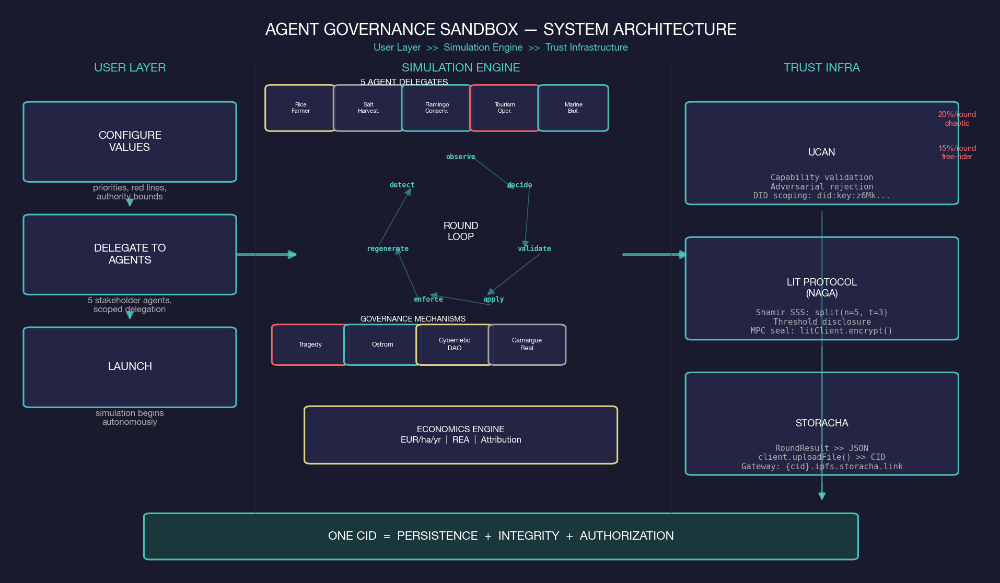
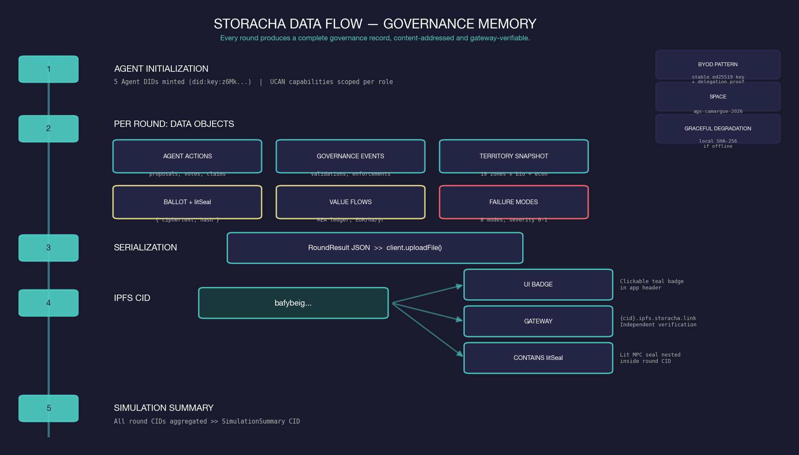
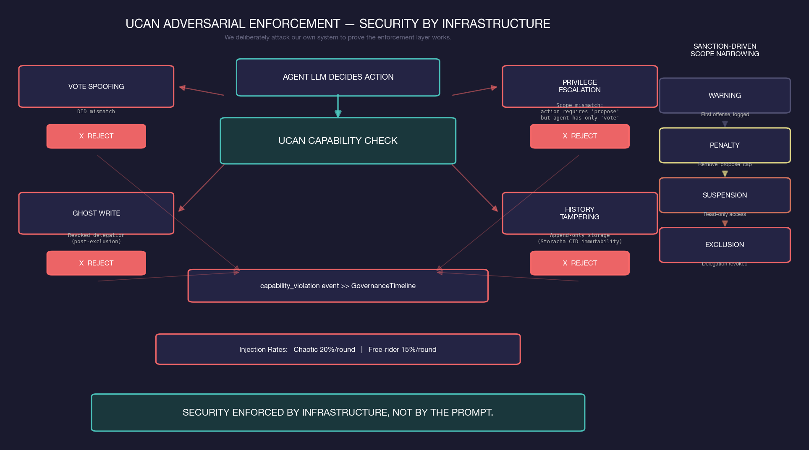
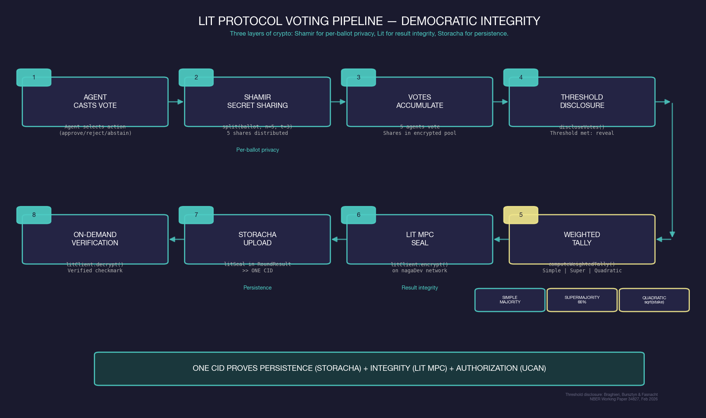

# Agent Governance Sandbox

**Configure AI delegates. Watch your commons thrive or collapse — in euros.**

A geoprospective governance simulator where five AI agents govern the Camargue UNESCO Biosphere Reserve under four institutional configurations. Every decision, vote, sanction, and territorial outcome is auditable, content-addressed, and EUR-denominated.

**Hackathon:** PL_Genesis: Frontiers of Collaboration
**Track:** Fresh Code — AI & Robotics + Infrastructure & Digital Rights
**Sponsor Bounties:** Storacha, Lit Protocol (NextGen AI Apps)
**License:** MIT
**Repo created:** February 17, 2026

---

## Problem

Multi-agent AI systems are being deployed to manage shared resources, but no tool exists to test which governance frameworks actually prevent commons collapse. Tragedy of the commons, Ostrom's principles, quadratic voting — debated in theory, never stress-tested with autonomous agents operating on real territorial data with real economic stakes.

## Solution

Five AI agent delegates govern the Camargue Rhone delta — 101,200 hectares where rice farmers, salt producers, conservationists, hunters, and tourism developers compete for shared water and land. Users configure agent values, delegate authority, and launch simulations across four governance presets. Zone economics are calibrated to actual Camargue production data: 360–610M EUR/yr in commodity value, 2.3B EUR/yr in ecosystem services.

## System Architecture



### Five AI Agent Delegates

| Agent | Stakeholder | Personality | Role |
|-------|------------|-------------|------|
| Tour du Valat | Conservationist | Cooperator | Protects wetlands, lagoons, Natura 2000 areas |
| Riziculteurs du Delta | Rice Farmer | Whale | Dominates water allocation for irrigation |
| Salins du Midi | Salt Producer | Strategic | Manages salt ponds, negotiates water balance |
| Chasseurs de Camargue | Hunter | Free-rider | Extracts from marshland without contributing |
| Saintes-Maries Tourisme | Tourism Dev | Chaotic | Unpredictable coastal development pressure |

### Four Governance Presets

| Preset | Description | Expected Outcome |
|--------|-------------|------------------|
| **Tragedy of the Commons** | No rules, open access, pure self-interest | Commons depletion in ~12 rounds |
| **Ostrom Commons** | Boundary rules, contribution requirements, graduated sanctions, threshold-disclosure voting | Sustainable commons with enforcement |
| **Cybernetic DAO** | Quadratic stake-weighted voting, dual-gated entry, stake slashing, 3-round deliberation | Adaptive self-regulation |
| **Camargue Real-World** | Mirrors actual PNRC/Natura 2000 institutional architecture since 1970 | Institutional mediation |

### Round Loop

Each round executes a seven-phase loop: **observe → decide → validate → apply → enforce → regenerate → detect**. Eight failure mode detectors with continuous severity (0–1) provide early-warning indicators. Replicator dynamics from evolutionary game theory overlay mathematical cooperation predictions on actual agent behavior.

---

## Sponsor Integration: Storacha

> Storacha is not just a storage backend. It is the governance enforcement infrastructure.



**Storage:** Every simulation round uploads a `RoundResult` JSON object to a provisioned Storacha space (`ags-camargue-2026`). Each upload produces a real IPFS CID, gateway-verifiable at `https://{cid}.ipfs.storacha.link`. CID badges in the UI link directly to the gateway.

**UCAN Delegation:** Every agent receives an ephemeral DID (`did:key:z6Mk...`) and scoped UCAN capabilities:

| Agent Role | Capabilities | Scope |
|-----------|-------------|-------|
| Basic (cooperator, free-rider, chaotic, whale) | `vote`, `propose` | Cast ballots, submit proposals |
| Governance body | `vote`, `propose`, `enforce`, `modify_rules` | Full authority including sanctions |

### UCAN Adversarial Enforcement



**Adversarial Capability Testing:** Chaotic agents (20%/round) and free-rider agents (15%/round) attempt unauthorized actions — vote spoofing, privilege escalation, ghost writes after exclusion, history tampering. The UCAN layer rejects every unauthorized action cryptographically and logs it as a `capability_violation` event visible in the governance timeline.

**Sanction-Driven Scope Narrowing:** Graduated sanctions narrow UCAN capabilities: warnings are reputation-only, penalties remove `propose`, suspensions make agents read-only, exclusions revoke delegation entirely.

**Graceful Degradation:** If Storacha is unavailable, the app falls back to local SHA-256 pseudo-CIDs. Pseudo-CIDs are labeled `(local)` in the UI.

**Key files:** `src/engine/storage/storacha.ts`, `src/engine/identity/agent-did.ts`, `src/engine/identity/ucan-validator.ts`, `src/engine/agents/adversarial.ts`

---

## Sponsor Integration: Lit Protocol

> Three layers of crypto: Shamir for per-ballot privacy, Lit for result integrity, Storacha for persistence.



1. **Per-ballot encryption (Shamir SSS):** Each agent's vote is split into threshold shares using Shamir Secret Sharing (`split(ballot, n=5, t=3)`). Fast, in-browser, per-ballot.
2. **Threshold disclosure:** Votes accumulate in an encrypted pool. `discloseVotes()` reveals ballots only when the majority crosses a configurable threshold — preventing strategic manipulation while preserving accountability (Braghieri, Bursztyn & Fasnacht, NBER Working Paper 34827, Feb 2026).
3. **Weighted tally:** Simple majority, supermajority (66%), or quadratic (sqrt of stake).
4. **Result sealing (Lit MPC):** `litClient.encrypt()` on the Naga (`nagaDev`) network using BLS threshold encryption across Lit's MPC nodes.
5. **Storacha upload:** The Lit seal is stored *within* the `RoundResult` on Storacha. One CID proves persistence (Storacha) + integrity (Lit MPC) + authorization (UCAN).
6. **On-demand verification:** "Verify on Lit Network" button calls `litClient.decrypt()` with verifying/verified/failed states.

**Graceful Degradation:** If Lit is unavailable, Shamir SSS results remain valid. The simulation never breaks.

**Key files:** `src/engine/lit/client.ts`, `src/engine/lit/seal.ts`, `src/engine/voting/threshold-disclosure.ts`, `src/engine/mechanisms/voting.ts`

---

## Quick Start

```bash
npm install
npm run dev          # localhost:5173
npm run build        # production build
```

### Environment Variables

| Variable | Required | Default | Description |
|----------|----------|---------|-------------|
| `VITE_STORACHA_KEY` | No | — | Stable ed25519 signer key for Storacha BYOD |
| `VITE_STORACHA_PROOF` | No | — | Base64 delegation proof for Storacha space |
| `VITE_LIT_ENABLED` | No | `true` | Set `false` to disable Lit Protocol |
| `VITE_UCAN_ENABLED` | No | `true` | Set `false` to disable UCAN enforcement |
| `VITE_ANTHROPIC_API_KEY` | No | — | Anthropic API key for Claude-powered agents |

Without any env vars, the app runs with deterministic agent behavior, local pseudo-CIDs, and Shamir-only voting. Each integration activates independently.

---

## Architecture

```
src/
  engine/
    simulation.ts              # Core round loop: validate → apply → enforce → regenerate → detect
    territory.ts               # GeoJSON → Territory with density-dependent regeneration
    agents.ts                  # 5 Camargue stakeholder agent factory
    governance/
      presets.ts               # 4 governance configuration presets
    mechanisms/
      validation.ts            # Action validation against governance rules
      effects.ts               # Action application to agents and territory
      enforcement.ts           # Contribution checks, graduated sanctions
      regeneration.ts          # Density-dependent regeneration (Janssen spatial commons)
      failure-modes.ts         # 8 failure mode detectors with continuous severity
      replicator.ts            # Replicator dynamics cooperation prediction
      voting.ts                # Quadratic tallying, threshold disclosure, Lit seal
    identity/
      agent-did.ts             # Ephemeral DID generation (Ed25519)
      ucan-validator.ts        # UCAN capability enforcement + adversarial violation logging
    agents/
      adversarial.ts           # Adversarial behavior injection (vote spoofing, escalation)
    storage/
      storacha.ts              # Storacha SDK, BYOD upload, gateway retrieval, CID fallback
    lit/
      client.ts                # Lit Protocol nagaDev client, lazy-loaded, ephemeral wallet
      seal.ts                  # Ballot result sealing (encrypt) and verification (decrypt)
    voting/
      threshold-disclosure.ts  # Shamir SSS split/combine for per-ballot encryption
    llm/
      client.ts                # Anthropic SDK wrapper (Claude Haiku 4.5)
      prompts.ts               # Per-agent system prompts from delegation configs
      runtime.ts               # LLM action generation with Zod validation + deterministic fallback
    ecosystem/
      economics.ts             # Zone economics (EUR/ha/yr commodity + ecosystem services)
      green-assets.ts          # Carbon credits, biodiversity credits, water quality certs
      value-flows.ts           # REA value flow accounting
  components/
    TerritoryMap.tsx           # MapLibre map with zone health overlay
    AgentPanel.tsx             # Agent delegate cards with stats and impact charts
    GovernanceTimeline.tsx     # Event timeline + ballot viz + failure indicators
    IntroPanel.tsx             # Governance model selection, delegation console
    RoundTransition.tsx        # Round interstitial: metrics, discourse, agent voices
    MetricsCharts.tsx          # Recharts strip charts for round-by-round metrics
    DocsModal.tsx              # Methodology documentation (6 sections, formulas, sources)
  data/
    camargue.json              # 19-zone GeoJSON with economics and ecosystem services
```

## Tech Stack

| Layer | Technology |
|-------|-----------|
| Frontend | React 19, TypeScript, Vite |
| Map | MapLibre GL, react-map-gl (Carto Dark Matter + ESRI satellite) |
| Styling | Tailwind CSS 4 |
| Charts | Recharts |
| Icons | Phosphor Icons |
| Animation | Motion (Framer Motion) |
| Validation | Zod |
| Storage | **Storacha SDK** — real IPFS CIDs, gateway-verifiable |
| Identity | **UCAN** — ephemeral DIDs, scoped capabilities, adversarial enforcement |
| Encryption | **Lit Protocol** (Naga MPC) — BLS threshold encryption |
| Voting | `shamir-secret-sharing` — per-ballot Shamir SSS |
| Wallet | `viem` — ephemeral EOA for Lit auth |
| Spatial | `@turf/turf` |
| AI Agents | Anthropic SDK (Claude Haiku 4.5) with Zod structured output |

## Key Concepts

- **Geoprospective governance** — French territorial management: participatory spatial simulation for governance foresight
- **Simocratic governance** — AI agents as democratic delegates acting on behalf of configured human values
- **Ostrom's design principles** — Commons governance framework implemented as composable mechanisms
- **Threshold disclosure voting** — Encrypted ballots revealed only when majority crosses threshold (NBER 2026)
- **UCAN capability enforcement** — Cryptographic constraints on agent actions regardless of LLM reasoning
- **Replicator dynamics** — Evolutionary game theory predicting cooperation/defection equilibria
- **Density-dependent regeneration** — Zone health affected by neighbor health (Janssen spatial commons)
- **REA value flows** — Resources-Events-Agents accounting tracking EUR value creation and destruction

## Intellectual Lineage

| Source | Contribution | Relationship |
|--------|-------------|-------------|
| **AI Mechanism Design Atlas** (aidesignatlas.xyz) | 33 mechanisms, 26 failure modes, Ostrom commons governance | Published research. Mechanism definitions inform simulation rules. |
| **Endosphere** (essay) | Sloterdijk spherology applied to crypto co-immunity | Philosophical grounding. No code. |
| **Topocurrencies** (research) | Spatial governance, agent coordination | Research context. No code reuse. |

## License

MIT
